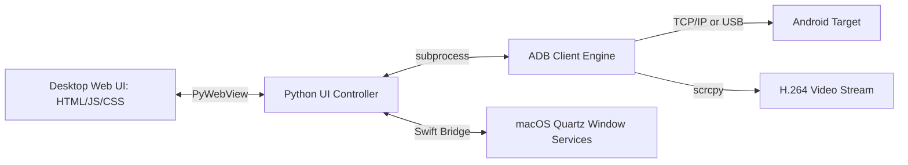

# ConnectPhone: macOS Integration Engine for Android

[](LICENSE)
[]()
[]()
[]()

## Overview
ConnectPhone is an industry-grade integration engine and desktop dashboard designed to seamlessly bridge Android devices with macOS environments. It combines high-performance backend pipelines (`scrcpy` and `adb` cores) with a cutting-edge Neumorphic, Dark-Mode User Interface rendered via PyWebView.

## Problem Statement
Mobile developers and QA engineers often require multiple disconnected tools for screen mirroring, executing ADB shell commands, monitoring live system telemetry, and recording device streams. Existing solutions are either heavily terminal-reliant or lack deep OS integration. ConnectPhone consolidates these workflows into a single, cohesive macOS application to eliminate contextual friction during debugging.

## Key Features
- **Zero-Latency Mirroring:** High-fidelity screen and camera previews via USB or Wireless Debugging utilizing customized `scrcpy` pipes.
- **Advanced Audio Routing:** Dynamic audio routing from device microphone, system audio, or external Bluetooth hardware.
- **Live System Telemetry:** Real-time extraction and visualization of device memory allocation, battery wear, and CPU load.
- **Native macOS Execution:** Compilable into a standalone `.app` bundle, functioning as a native desktop client without requiring a terminal instance.

## Architecture



## Technology Stack
- **Desktop Application:** PyWebView (Native macOS WebKit wrapper)
- **Backend Core:** Python 3.12
- **Hardware Bridge:** ADB (Android Debug Bridge), scrcpy, ffmpeg
- **Native Interop:** Swift (for Quartz Window tracking)
- **Frontend UI:** Vanilla JS, HTML, Custom Neumorphic CSS

## Project Structure
```text
ConnectPhone/
├── ConnectPhoneUI.py       # Desktop App Entry (PyWebView / HTTP Server)
├── adb_client.py           # Core ADB network and device communication engine
├── ui_controller.py        # CLI interface and menu routing logic
├── ConnectPhone.py         # Main Interactive Terminal CLI Command Center
├── build_mac.sh            # macOS PyInstaller build script for .app generation
├── get_window_id.swift     # Swift source referencing Quartz Window Services
├── test_adb_client.py      # Unit tests for ADB network layer
└── ui/                     # Web UI Frontend Assets
```

## Installation
Ensure macOS system-level dependencies are installed via Homebrew.
```bash
brew install android-platform-tools scrcpy ffmpeg
git clone https://github.com/krsna016/ConnectPhone.git
cd ConnectPhone
pip install -r requirements.txt
```

## Usage
### Option A: Standalone macOS App (Recommended)
Compile the application into a native `.app` bundle:
```bash
chmod +x build_mac.sh
./build_mac.sh
```

### Option B: PyWebView Execution
Run directly via the Python interpreter:
```bash
python3 ConnectPhoneUI.py
```

## Examples
*Executing a wireless ADB connection via the underlying Python module:*
```python
from adb_client import ADBClient
client = ADBClient(device_id="192.168.1.100:5555")
client.push_file("app-release.apk", "/data/local/tmp/")
```

## Screenshots
> [!NOTE]
> *UI dashboard screenshots are pending capture for the upcoming 2.0 Neumorphic release.*

## Visual Demonstrations
> [!NOTE]
> *Zero-latency wireless mirroring demonstration pending.*

## Testing
We enforce strict unit testing over the critical path of the ADB network layer using the standard `unittest` framework and robust mock injections to prevent hardware side-effects.
```bash
python3 -m unittest test_adb_client.py
```

## Performance Notes
- **Swift Bridges:** Utilizing a compiled Swift script (`get_window_id.swift`) provides deep C-level bindings to macOS Quartz Window Services, preventing the high CPU overhead found in Python objective-c bridges.
- **PyWebView Memory:** The UI operates on the native Safari/WebKit engine installed on macOS, ensuring minimal RAM bloat compared to Electron alternatives.

## Future Improvements
- Migration from `subprocess` calls to pure socket-level ADB tracking for instantaneous telemetry streaming without polling overhead.
- Native Apple Silicon (M-Series) hardware acceleration for the `scrcpy` decoding layer.

## Contributing
Please refer to standard open-source protocols before submitting Pull Requests. Focus PRs entirely on edge-case bug fixes or hardware specific performance enhancements.

## License
Licensed under the MIT License.
