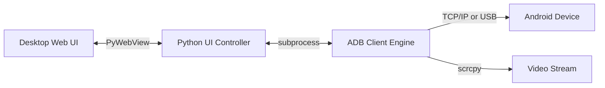

# 📱 ConnectPhone
<p align="center">
  
</p>

[](LICENSE)
[]()
[]()
[]()

## 📖 About The Project

`ConnectPhone` is an industry-grade integration engine and desktop dashboard designed to seamlessly bridge your Android device with macOS. Born from the need for a developer-centric, low-latency testing environment, it brings mobile app debugging, screen streaming, and system telemetry into a single, beautifully designed application.

The project merges high-performance backend pipelines (`scrcpy` and `adb` cores) with a cutting-edge **Neumorphic, Dark-Mode User Interface**. It is built for developers, QA engineers, and content creators who need pixel-perfect mirroring, custom audio routing, and instant recording capabilities directly from their Mac.

---

## 🚀 Key Features

* **🖥️ Native macOS App Experience**: Run ConnectPhone as a standalone, windowed macOS Application (`.app`) without touching a terminal.
* **📱 Zero-Latency Mirroring**: High-fidelity screen and camera previews via USB or Wireless Debugging utilizing customized `scrcpy` pipes.
* **🎙️ Advanced Audio Routing**: Route sound from your phone's microphone, system audio, or Mac earbuds/bluetooth devices. Features dynamic audio buffer adjustments and sync offsets.
* **🎥 Live Media Controls**: Capture high-definition video clips or snapshot framebuffers directly from the mirroring stream to your Mac Desktop with a single click.
* **📊 Live System Telemetry**: View real-time device stats, battery wear, memory allocation, and connection status inside the sleek visual dashboard.
* **🎨 Premium Dev-Aesthetic**: A stunning dark-mode UI with Space Grotesk typography, micro-animations, glowing metallic gradients, and Neumorphic design elements.

---

## 📋 System Requirements

To run this application on macOS, you must ensure the following system-level dependencies are installed:

1. **Android Debug Bridge (ADB)**: Standard Android console utility.
2. **scrcpy**: High-performance rendering engine (v2.0+ recommended).
3. **ffmpeg**: Media processor for audio routing, extraction, and video compilation.
4. **Xcode Command Line Tools**: Required to compile native Swift helpers (`swiftc`).

### 📦 Homebrew Installation
You can install all system requirements in a single command using Homebrew:
```bash
brew install android-platform-tools scrcpy ffmpeg
```

---

## 🛠️ Installation & Setup

1. **Clone the Repository**:
   ```bash
   git clone https://github.com/krsna016/ConnectPhone.git
   cd ConnectPhone
   ```

2. **Connect Your Android Device**:
   - **USB Connection**: Connect your phone via USB and trust the computer when prompted for USB Debugging authorization.
   - **Wireless Connection**: 
     1. Enable **Wireless Debugging** in your phone's Developer Options.
     2. Tap **Pair device with pairing code** or check connection details to note IP and Port.
     3. Start `ConnectPhone` and navigate to the connection manager to input connection coordinates.

### 🔒 macOS Security Permissions
ConnectPhone relies on PyWebView and ADB to inject input commands and mirror screens. To ensure flawless operation, you must grant the following macOS Privacy permissions to your Terminal (or the compiled `ConnectPhone.app`):
1. **Accessibility**: Open `System Settings > Privacy & Security > Accessibility` and toggle ON for Terminal/ConnectPhone. (Required for executing ADB keystrokes and unlocking the device).
2. **Screen Recording**: Open `System Settings > Privacy & Security > Screen Recording` and toggle ON. (Required for PyWebView to seamlessly render the scrcpy window layers).

---

## 🖥️ Running the Application

### Option A: Standalone macOS App (Recommended)
You can compile the Python UI into a native macOS `.app` bundle with a custom dock icon!
```bash
chmod +x build_mac.sh
./build_mac.sh
```
Once complete, you will find `ConnectPhone.app` in the `dist/` directory. Simply double-click it or drag it to your Applications folder!

### Option B: Python Native Window
Run the UI directly through PyWebView to spawn a native window:
```bash
python3 ConnectPhoneUI.py
```

### Option C: The Terminal Command Center
Run the legacy interactive CLI command deck:
```bash
python3 ConnectPhone.py
```

---

## 🕹️ Project Architecture



```text
ConnectPhone/
├── ConnectPhone.py         # Main Interactive Terminal CLI Command Center
├── adb_client.py           # Core ADB network and device communication engine
├── ui_controller.py        # CLI interface and menu routing logic
├── ConnectPhoneUI.py       # Desktop App Entry (PyWebView / HTTP Server)
├── build_mac.sh            # macOS PyInstaller build script for .app generation
├── requirements.txt        # Documentation of dependencies
├── LICENSE                 # MIT License details
└── ui/                     # Web UI Frontend Assets
    ├── index.html          # Web dashboard structure
    ├── index.css           # Neumorphic CSS layout
    ├── index.js            # Frontend control behaviors
    └── logo.png            # Official app branding
```

---

## 🛡️ License

This project is licensed under the MIT License. See the [LICENSE](LICENSE) file for the full license text.
