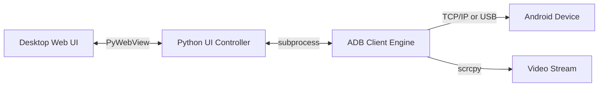

# ConnectPhone

> **Restorable checkpoint:** The source and exact signed app for the proven
> working v2.0.0 build are preserved in the
> [`v2.0.0-working`](https://github.com/krsna016/ConnectPhone/releases/tag/v2.0.0-working) release. See the
> [checkpoint and rollback instructions](docs/checkpoints/v2.0.0-working.md).

[](LICENSE)
[]()
[]()
[]()

## About The Project

`ConnectPhone` is a macOS desktop dashboard for authorized Android devices. It brings ADB connection management, screen streaming, file transfer, and system telemetry into one application.

The project merges high-performance backend pipelines (`scrcpy` and `adb` cores) with a cutting-edge **Neumorphic, Dark-Mode User Interface**. It is built for developers, QA engineers, and content creators who need pixel-perfect mirroring, custom audio routing, and instant recording capabilities directly from their Mac.

---

## Key Features

* **Native macOS App Experience**: Run ConnectPhone as a standalone, windowed macOS Application (`.app`) without touching a terminal.
* **Low-Latency Mirroring**: Screen and camera previews via USB or Wireless Debugging using `scrcpy`.
* **Advanced Audio Routing**: Route sound from your phone's microphone, system audio, or Mac earbuds/bluetooth devices. Features dynamic audio buffer adjustments and sync offsets.
* **Mirroring and Recording**: Mirror the phone, stream its camera or audio, and save recording sessions to your Mac Desktop.
* **Live System Telemetry**: View real-time device stats, battery wear, memory allocation, and connection status inside the sleek visual dashboard.
* **Trusted Wireless Reconnect**: Manually enrolled wireless devices are checked by identity before automatic reconnect. Unknown devices are never enrolled silently.
* **Secure Companion Mode**: Explicitly enrolled phones can reconnect without ADB for encrypted device status and alert commands, using per-phone Keychain secrets, replay protection, a strict capability allowlist, and immediate revocation. See the [security design](docs/SECURE_COMPANION.md).
* **10-Phone Fleet Control**: Reconnect every trusted phone, choose the target for legacy tools, open independently routed screen/camera/audio windows, or mirror and control all online phones together. See the [multi-device guide](docs/MULTI_DEVICE.md).
* **Local API Protection**: The dashboard and local control API bind to loopback and require a fresh random token on every app launch.
* **Premium Dev-Aesthetic**: A stunning dark-mode UI with Space Grotesk typography, micro-animations, glowing metallic gradients, and Neumorphic design elements.

---

## Storage Manager & Keyboard Controls

ConnectPhone includes a built-in phone storage browser that integrates deeply with macOS:
* **Layout View Toggle**: Quickly switch between a detailed **List View** and a clean, responsive **Grid View**.
* **Batch Actions**: Select multiple files or folders using checkbox columns to perform bulk deletions or download selected items directly as a single compiled ZIP archive.
* **Native macOS Downloads**: File downloads bypass sandbox restrictions. They save directly to your Mac's `~/Downloads` folder and automatically highlight the downloaded file/archive in Finder.
* **Bidirectional Drag & Drop**:
  * **Mac to Phone**: Drag multiple files or folders from Finder and drop them anywhere into the Storage Browser panel to upload them sequentially.
  * **Phone to Mac**: Drag any file row out of the application window and drop it onto your Mac Desktop or Finder folder to download it instantly.
* **Glassmorphic Image Previewer**: Double-click any image to trigger a centered, compact preview card. Supports zooming, 90° rotation, and image slider navigation.
* **Full Keyboard Navigation**:
  * **Arrow Up / Arrow Down**: Move focus highlight through items in the directory.
  * **Enter**: Navigate into the focused directory or open the image previewer.
  * **Spacebar**: Check/uncheck selection for the focused item.
  * **Backspace / Delete**: Navigate back to the parent directory (automatically ignores keypresses when typing inside input/search boxes).
  * **Escape** (inside Gallery): Close the image previewer.
  * **Arrow Left / Arrow Right** (inside Gallery): Slide to the previous/next image.
* **Apple Trackpad Gestures**:
  * **Two-finger swipe left-to-right**: Navigate back to the parent directory in the file browser.
  * **Two-finger horizontal swipe** (inside Gallery): Navigate to the previous or next image.
  * **Pinch-in / Pinch-out** (inside Gallery): Standard pinch gestures dynamically zoom in and out of the active image.

---

## System Requirements

ConnectPhone's packaged desktop build currently targets Apple Silicon (arm64) on macOS 13 or later. To run from source or build the app, ensure the following system-level dependencies are installed:

1. **Android Debug Bridge (ADB)**: Standard Android console utility.
2. **scrcpy**: High-performance rendering engine (v2.0+ recommended).
3. **ffmpeg**: Media processor for audio routing, extraction, and video compilation.
4. **Xcode Command Line Tools**: Required to compile native Swift helpers (`swiftc`).
5. **OpenJDK 17**: Required only when building the bundled Android Companion.

### Homebrew Installation
You can install all system requirements in a single command using Homebrew:
```bash
brew install android-platform-tools scrcpy ffmpeg
brew install openjdk@17 # source builds only
```

---

## Installation & Setup

1. **Clone the Repository**:
   ```bash
   git clone https://github.com/krsna016/ConnectPhone.git
   cd ConnectPhone
   ```

2. **Connect Your Android Device**:
   - **USB Connection**: Connect your phone via USB and trust the computer when prompted for USB Debugging authorization.
   - **Wireless Connection**: 
     1. Enable **Wireless Debugging** in your phone's Developer Options.
     2. Tap **Pair device with pairing code** or check connection details to note IP and Port.
     3. Start `ConnectPhone` and navigate to the connection manager to input connection coordinates.

### macOS Security Permissions
ConnectPhone relies on PyWebView and ADB to inject input commands and mirror screens. Grant the following macOS Privacy permissions to the compiled `ConnectPhone.app` (or Terminal when running from source):
1. **Accessibility**: Open `System Settings > Privacy & Security > Accessibility` and toggle ON for Terminal/ConnectPhone. (Required for executing ADB keystrokes and unlocking the device).
2. **Screen Recording**: Open `System Settings > Privacy & Security > Screen Recording` and toggle ON. (Required for PyWebView to seamlessly render the scrcpy window layers).

---

## Running the Application

### Option A: Standalone macOS App (Recommended)
You can compile the Python UI into a native macOS `.app` bundle with a custom dock icon!
```bash
chmod +x build_mac.sh
./build_mac.sh
```
Once complete, you will find `ConnectPhone.app` in the `dist/` directory. Simply double-click it or drag it to your Applications folder!

The default command creates an ad-hoc-signed development macOS app containing a
debug-signed Companion APK. For a distributable release, set
`CONNECTPHONE_RELEASE=1`, `CONNECTPHONE_SIGN_IDENTITY`, the four
`CONNECTPHONE_ANDROID_*` signing variables documented in `build_mac.sh`, and
optionally `CONNECTPHONE_NOTARY_PROFILE`. Signing keys and passwords must remain
outside the repository.

### Option B: Python Native Window
Run the UI directly through PyWebView to spawn a native window:
```bash
python3 ConnectPhoneUI.py
```

### Option C: The Terminal Command Center
Run the legacy interactive CLI command deck:
```bash
python3 ConnectPhone.py
```

---

## Project Architecture


```mermaid
graph LR
    UI[Desktop Web UI] <-->|PyWebView| Controller[Python UI Controller]
    Controller <-->|subprocess| ADB[ADB Client Engine]
    ADB -->|TCP/IP or USB| Android[Android Device]
    ADB -->|scrcpy| Screen[Video Stream]
```

```text
ConnectPhone/
├── ConnectPhone.py         # Main Interactive Terminal CLI Command Center
├── adb_client.py           # Core ADB network and device communication engine
├── ui_controller.py        # CLI interface and menu routing logic
├── ConnectPhoneUI.py       # Desktop App Entry (PyWebView / HTTP Server)
├── build_mac.sh            # macOS PyInstaller build script for .app generation
├── requirements.in         # Direct Python dependency policy
├── requirements.txt        # Fully resolved Python dependency lock
├── LICENSE                 # MIT License details
└── ui/                     # Web UI Frontend Assets
    ├── index.html          # Web dashboard structure
    ├── index.css           # Neumorphic CSS layout
    ├── index.js            # Frontend control behaviors
    └── ConnectPhone.icns    # macOS app icon
```

---

## License

This project is licensed under the MIT License. See the [LICENSE](LICENSE) file for the full license text.

Security issues should be reported privately as described in [SECURITY.md](SECURITY.md).
